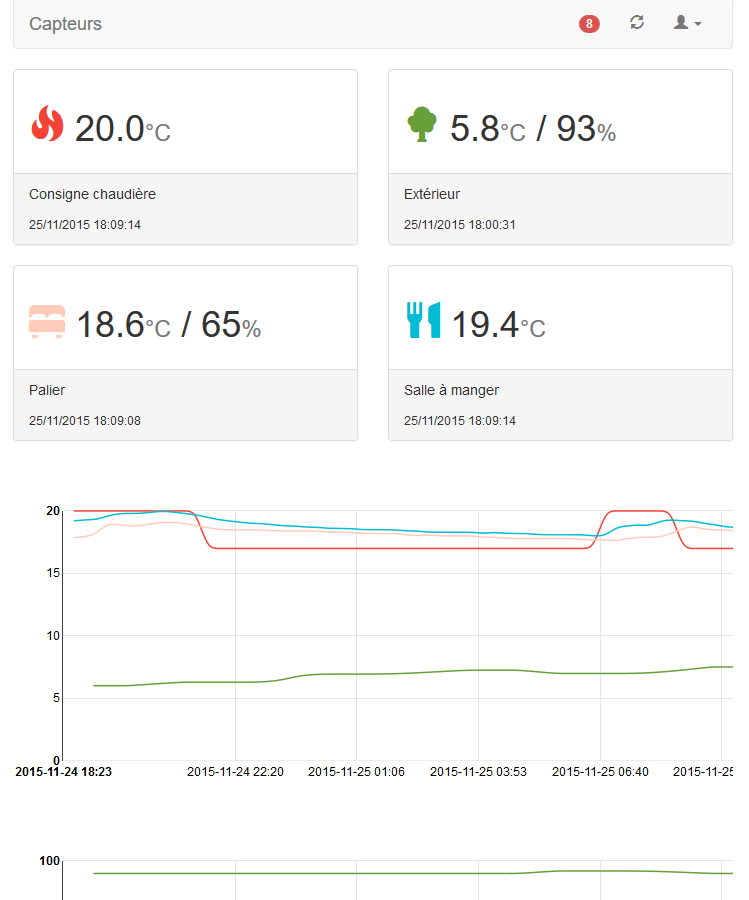

# Firebase based temperature / humidity logger

## The idea

The idea came from [Tim Hodson](https://github.com/timhodson/rpi-sensor-station) who [blogged about it](http://timhodson.com/2014/04/rpi-sensor-network-collecting-the-data/) some time ago. So huge thanks to him.

## Firebase

### My goal

My goals were simple:
 * No limit in the number of sensors.
 * Adding a new sensor should only mean to modify a little the database and upload the readings but **never** change a single line of the Web UI.

### Structure

It was kind of hard for me to structure the base as I'm more used to relationnal databases. I ended up doing this :

```
root
  errors
    GUID
      time
      message
  readings
    room_id
      GUID
        time
        temp
        hum
  rooms
    room_id
      label
      color
      icon
      readings
        temp
        hum
```

### Security

TODO

### Todo

I'll probably add the battery level of some sensors, that will mean changing the database structure and the Web UI.

## The Web UI

### Disclaimer

For now it is only one file with the angular code, the dependencies and the HTML. I know that's bad design. On the other side the page is really small so it make things easy. Going to a full bower, gulp, npm powered app is on my todo list.

### How does it look ?



### How do I make this work

Easy :
 * Edit `firebase.html` and adapt this line `var fireBaseUrl = "https://<YOUR OWN APP URL>.firebaseio.com";`
 * Put `firebase.html` on your web server.
 * Access it.

# Licence

As stated in the LICENCE file, everything here is licensed under the GPL V2
